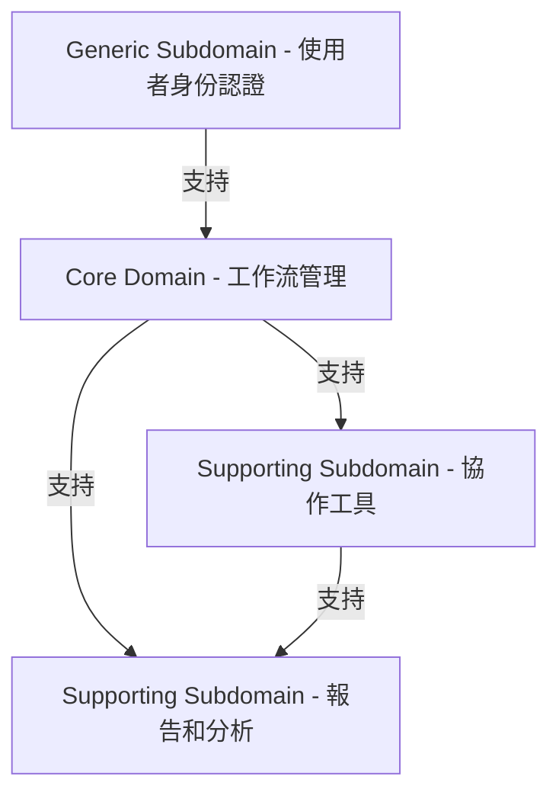

# Domain-Driven Design

## Domain

### Problem Space

1. **任務管理**：團隊成員需要一個有效的系統來管理和追蹤待完成的任務，以確保工作的及時完成。
2. **問題追蹤**：團隊面臨著許多問題和障礙，需要一個系統來追蹤、管理和解決這些問題，以確保項目的進展。
3. **工作流管理**：不同類型的任務和問題可能需要不同的處理流程和工作流程，需要一個靈活的系統來定義和管理這些流程。
4. **協作和溝通**：團隊成員需要一個平台來進行協作和溝通，分享想法、討論問題，以提高工作效率和合作。
5. **報告和分析**：團隊需要定期生成各種報告、統計和分析，以評估工作進展、效率和問題分佈，並做出相應的決策和調整。
6. **可擴展性和定制性**：由於不同團隊和項目的需求各異，系統需要具有足夠的可擴展性和定制性，以滿足不同場景下的需求。
7. **使用者身份驗證和授權**：確保系統中的敏感資料和功能只能被授權的使用者訪問，以保護資料的安全性和隱私性。

#### Core Domain

1. 工作流管理：這是產品的核心競爭力，能夠提供靈活且有效的工作流程管理，以支援團隊的任務和問題處理。

#### Supporting Subdomain

1. 協作工具：雖然不是產品的核心競爭力，但提供有效的協作工具可以支援核心功能的順利執行，包括討論區、評論功能等。
2. 報告和分析：雖然不是直接的核心功能，但提供報告和分析功能可以幫助團隊更好地理解工作進展和效率，從而支援核心競爭力的發揮。

#### Generic Subdomain

1. 使用者身份認證：雖然不是核心競爭力，但身份認證是系統的基本需求，市場上已有成熟的解決方案可供使用。

### Solution Space

#### Bounded Contexts

1. **Workflow**：
    - 這個 Bounded Context 專注於實現工作流程的管理和執行。它負責定義和管理任務和問題的狀態轉換，以及支持工作流程的順利執行。

2. **Collaboration**：
    - 這個 Bounded Context 專注於提供協作工具，以支持團隊成員之間的溝通和協作。它包括討論區、評論功能等，以增強團隊之間的互動和合作。

3. **Reporting**：
    - 這個 Bounded Context 專注於提供報告和分析功能，以幫助團隊更好地理解工作進展和效率。它負責生成各種報告和分析，從而支援團隊的決策和優化工作流程。

4. **Identity**：
    - 這個 Bounded Context 專注於處理使用者身份認證和授權，確保系統的安全性和使用者身份的有效性。它可能會集成現有的身份認證解決方案，以確保安全性並提供用戶友好的身份管理功能。
